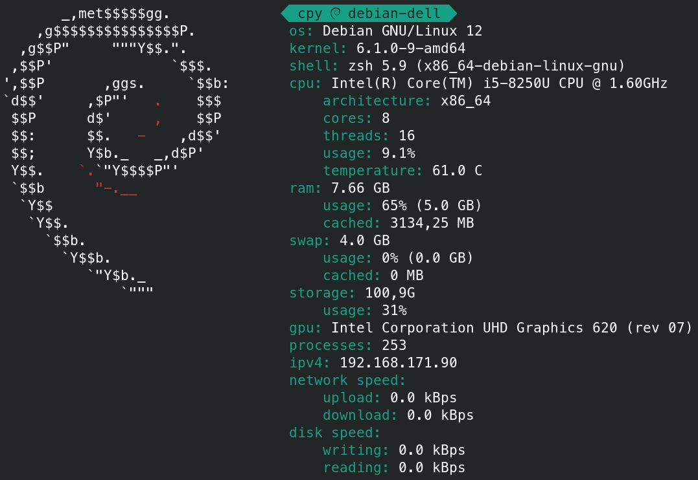

# Sysfetch
Command-line system information tool written in Python.\
Features hardware and operative system centered information.



Inspired by Neofetch and PowerLevel10k

## Install 
To install sysfetch in your system, you need to execute "install.sh" file with root privilegies:

```commandline
$ ./install.sh
```

The script will create a folder called "sysfetch" in "/usr/share", and will copy "distros.py" into it. \
The "sysfetch" main script will be copied into "/usr/local/bin".

It is also required to have installed the package "psutil", 
which can be installed both by your distro's package manager or
by pip

```commandline
$ pip install psutil
```

## Usage

```commandline
$ sysfetch
```
To decrease execution time, Sysfetch implements a cacheing method, 
which locally stores all "static" data featured.

If you want data to be recached, in case you changed something in 
your device which concerns "static" data, simply use:

```commandline
$ sysfetch recache
```
It is a good practice to recache at least once a week.

If you desire to use a color different from default one (purple), 
you can change it by:

```commandline
$ sysfetch color aquagreen
```

Available colors:
- grey
- red
- yellow
- purple
- green
- lightblue
- blue
- orange
- aquagreen

To get help about usage, it is available the "--help" option:

```commandline
$ sysfetch --help
```


If you wish to set a personalised default behaviour, you can edit the configurartion file
located in "$HOME/.sysfetch/conf.json". Example configuration:

```json
{
  "ascii-art" : "debian",
  "separator-unicode" : "debian",
  "default-color" : "aquagreen",
  "always-recache" : false
}
```

Leave blank if you want to keep the standard behaviour.

Once done with conf.json, to load your changes it is required to recache.

Available always-recache values:
- true
- false

Available separator unicode:
- alpine
- macos
- arch
- debian
- kali
- parrot
- endeavour
- raspbian
- manjaro
- centos
- opensuse
- redhat
- sabayon
- slackware
- mandriva
- mangeia
- devuan
- tux

Available colors:
- grey
- red
- yellow
- purple
- green
- lightblue
- blue
- orange
- aquagreen

Available ascii-art:
 - armbian
 - aix
 - alpine
 - alterlinux
 - anarchy
 - android
 - antergos
 - antix
 - aosc os
 - aosc os/retro
 - apricity
 - arcolinux
 - archbox
 - archlabs
 - archstrike
 - xferience
 - archmerge
 - arch
 - artix
 - arya
 - bedrock
 - bitrig
 - blackarch
 - blag
 - blankon
 - bluelight
 - bonsai
 - bsd,bunsenlabs
 - calculate
 - carbs
 - centos
 - chakra
 - chaletos
 - chapeau
 - chrom
 - cleanjaro
 - clearos
 - clear_linux
 - clover
 - condres
 - container_linux
 - crux
 - cucumber
 - debian
 - deepin
 - desaos
 - devuan
 - dracos
 - darkos
 - dragonfly
 - drauger
 - elementary
 - endeavouros
 - endless
 - eurolinux
 - exherbo
 - fedora
 - feren
 - freebsd
 - freemint
 - frugalware
 - funtoo
 - galliumos
 - garuda
 - gentoo
 - pentoo
 - gnewsense
 - gnome
 - gnu
 - gobolinux
 - grombyang
 - guix
 - haiku
 - huayra
 - hyperbola
 - janus
 - kali
 - kaos
 - kde_neon
 - kibojoe
 - kogaion
 - korora
 - kslinux
 - kubuntu
 - lede
 - lfs
 - linux_lite
 - lmde
 - lubuntu
 - lunar
 - macos
 - mageia
 - magpieos
 - mandriva
 - manjaro
 - maui
 - mer
 - minix
 - linuxmint
 - mx_linux
 - namib
 - neptune
 - netbsd
 - netrunner
 - nitrux
 - nixos
 - nurunner
 - nutyx
 - obrevenge
 - openbsd
 - openeuler
 - openindiana
 - openmamba
 - openmandriva
 - openstage
 - openwrt
 - osmc
 - oracle
 - os elbrus
 - pacbsd
 - parabola
 - pardus
 - parrot
 - parsix
 - trueos
 - pclinuxos
 - peppermint
 - popos
 - porteus
 - postmarketos
 - proxmox
 - puppy
 - pureos
 - qubes
 - radix
 - raspbian
 - reborn_os
 - redstar
 - redcore
 - redhat
 - refracted_devuan
 - regata
 - rosa
 - sabotage
 - sabayon
 - sailfish
 - salentos
 - scientific
 - septor
 - serenelinux
 - sharklinux
 - siduction
 - slackware
 - slitaz
 - smartos
 - solus
 - source_mage
 - sparky
 - star
 - steamos
 - sunos
 - opensuse_leap
 - opensuse_tumbleweed
 - opensuse
 - swagarch
 - tails
 - trisquel
 - ubuntu-budgie
 - ubuntu-gnome
 - ubuntu-mate
 - ubuntu-studio
 - ubuntu
 - venom
 - void
 - obarun
 - windows10
 - windows7
 - xubuntu
 - zorin
 - irix
 - tux